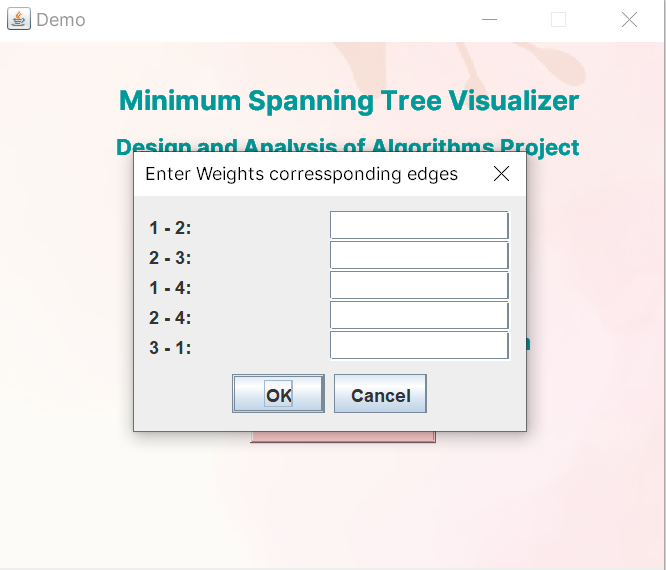

# Kruskal Algorithm Visualizer

## Table of Contents

- [Overview](#overview)
- [Features](#features)
- [Getting Started](#getting-started)
  - [Prerequisites](#prerequisites)
  - [Installation](#installation)
- [Screenshots](#screenshots)
- [Technologies Used](#technologies-used)
- [Contributing](#contributing)
- [Contact](#contact)

## Overview

The Kruskal Algorithm Visualizer is a Java Swing application that allows users to input graph data, visualize the Kruskal algorithm's execution, and view the resulting Minimum Spanning Tree (MST). This tool provides a hands-on way to understand how the Kruskal algorithm works and visualize its output.

## Features

- **Graph Creation:** Users can input nodes, edges, and edge weights to create a graph visually.

- **Algorithm Visualization:** The application visually guides users through the steps of the Kruskal algorithm, highlighting the edges considered and those included in the MST.

- **Table Display:** Once the MST is computed, the tool displays a table with the edges in the MST and their corresponding weights, as well as the total cost of the MST.

## Getting Started

### Prerequisites

- Java Development Kit (JDK) installed on your system.
- NetBeans or another Java IDE for running the application.

### Installation

1. **Clone the Repository:**

2. **Open in NetBeans:**

Open the project in NetBeans or your preferred Java development environment.

3. **Build and Run:**

Build the project and run the application.

4. **Input Graph Data:**

Enter the graph data as prompted (nodes, edges, weights).

5. **Visualize MST:**

Start the visualization, and the application will guide you through the Kruskal algorithm's steps.

## Screenshots

## Technologies Used

- Java
- Java Swing (for GUI)
- Git (for version control)

## Contributing

If you'd like to contribute to this project, please follow these guidelines:

1. Fork the repository.
2. Create a new branch for your feature or bug fix.
3. Make your changes and commit them with descriptive commit messages.
4. Push your branch to your fork and create a pull request to the `main` branch of this repository.

## Contact
You can contact me via email [Your Name](mailto:sarahahmadmalik55@gmail.com) or linkedIn [Your Name](https://www.linkedin.com/in/sara-ahmad-malik-793429257/) 

 
